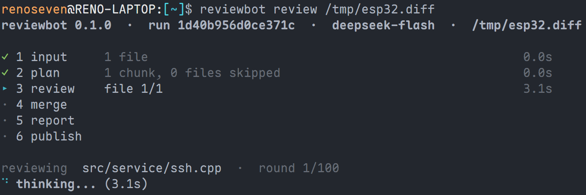
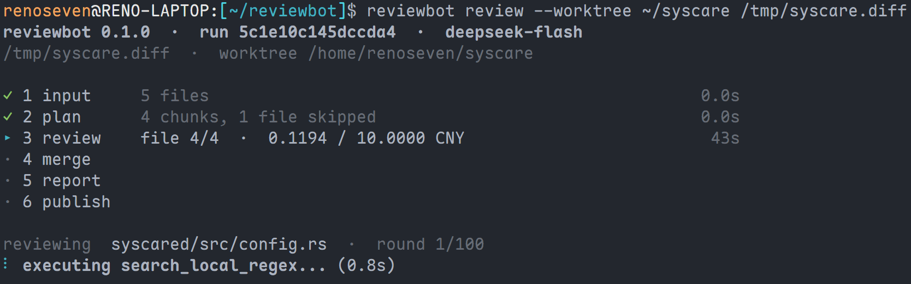
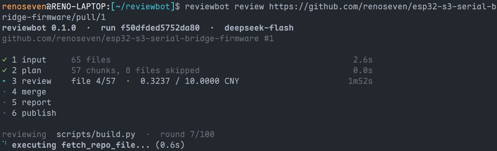
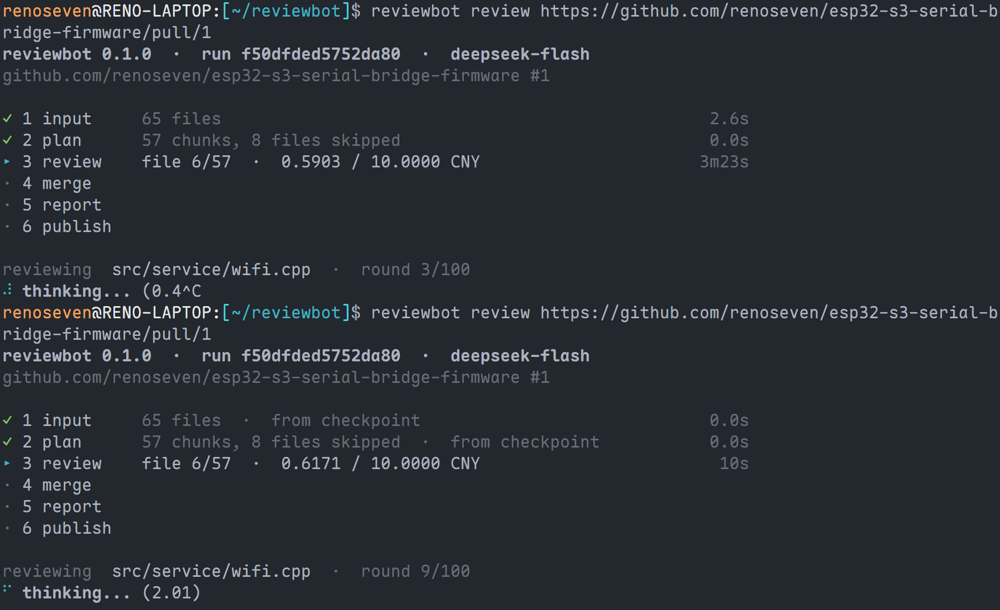

# reviewbot

用语言模型评审 GitLab Merge Request、GitHub Pull Request，或一份原始 unified diff。形态是一次性 CLI：跑完写出带 trace 的报告；给了 `--publish` 再把意见发回 MR/PR。不是常驻服务，也不改你的代码。

生产上就是 CI 里的一步。本地同样能跑。

| 文档 | 内容 |
|---|---|
| [整体设计](docs/design.md) | 阶段、数据模型、配置、适配器、预算与退出码 |
| [设计决策](docs/decisions.md) | 现行取舍与一句理由 |
| [编译与安装](docs/build.md) | 从没有 Rust 的机器编到装进 `PATH` |
| [CI 落地](docs/ci.md) | 流水线形状、密钥、`summary.json` 怎么卡。**还没对着真实流水线调过** |
| [原型实现计划](docs/prototype.md) | 当时把设计落成原型的 M1–M8。**已经做完**，不是现行路线图 |

许可证 [MIT](LICENSE-MIT) 或 [Apache-2.0](LICENSE-APACHE)，任选其一。

---

## 项目介绍

输入是三种形状之一：MR/PR 的 `https://` URL、磁盘上的 diff 文件，或 stdin（`-`）。输出始终有两份：run 目录里的 `report.md` 与 `summary.json`。URL 输入还可以加 `--publish`，把同一套 comment / `trace_id` 发回平台。

一次评审拆成六个固定阶段：

```
input → plan → review ⇄ tools → merge → report → publish
```

`review` 按文件（必要时按 hunk）把 diff 送给模型；模型用受控工具补上下文、用 `submit_comment` 交意见、用 `finish_review` 收工。`merge` 做解析、剔越界、行号对齐、引文核对、去重、定序，再要一次总体评分。分数是模型给的 0–100 整数，reviewbot 不改。

**做**：拉变更、带工具调查、分级、出报告；按需发帖。

**不做**：结对编程、改用户代码、自动合并、自己克隆仓库、把「代码好不好」写进退出码。要卡流水线，从 `summary.json` 自己判。

配置只认 `--config`，默认 `~/.reviewbot/config.toml`，不从当前目录查找。密钥在配置里只写来源（环境变量名或仓库外的凭据文件），不写密钥本身。

---

## 整体设计

现行实现以 [docs/design.md](docs/design.md) 为准。这里只勾轮廓。

六个阶段互不依赖，顺序只写在 `lib.rs` 的 `review()` 里。前四个阶段有还有效的 checkpoint 就跳过；`report` 与 `publish` 每次进入都重跑。没有编排模块。

分三层，依赖单向向下：

| 层 | 装什么 |
|---|---|
| 阶段 | `input` / `plan` / `review` / `merge` / `report` / `publish` |
| 适配器 | `platform`（GitLab / GitHub）、`worktree`、`protocol`（目前 `openai`）、`tool` |
| 设施 | `domain`、`config`、`security`、`budget`、`record`、`common`、`progress` |

一次 run 的身份是 `run_id = hash(输入标识 + head_sha)` 的前 16 位十六进制。配置不在里面：同一输入同一 commit 总进同一个目录；改了配置仍进该目录，从最早受影响的阶段起重跑。重新进入一个 run 的办法是把同一条 `review` 命令再敲一遍，没有 `resume` / `publish` / `report` 子命令。

worktree 是三个变体，不是扩展点：`--worktree` 指向的只读检出、`Cache`（按需从平台取回）、或纯 diff 且无平台时的 `Empty`。reviewbot 自己不克隆。

扩展点是平台、协议、外部 `[[tool]]`。内建工具不进配置，也关不掉。

---

## 设计决策

取舍全文见 [docs/decisions.md](docs/decisions.md)。几条会反复碰到：

- **做 CLI，不做常驻服务。** CI 已经提供调度、密钥和日志；预算按 run 冻结。
- **一个设定只有一个来源。** 团队约定进配置，机器事实与本次调用进命令行。`[security]` 禁止命令行覆盖。
- **评审结论不进退出码。** 「工具自己出事」和「代码有问题」不能共用一个通道。
- **自己不克隆。** 完整检出由调用方准备，再 `--worktree`。
- **意见用 function call 交，结束信号只有 `finish_review`。** 不从聊天正文抽 JSON。
- **严重程度与置信度都由模型给分，reviewbot 一个都不改。** 引文核对只贴 `found by tool` 或 `quote unverified`。
- **`review` 是进入一个 run 的唯一命令。** `run_id` 由那条命令上的输入算出来。

对话原文仍在 [docs/conversations/](docs/conversations/)，不再追加。

---

## 编译

需要 `rustc` **1.85+**（`edition = "2024"`）和系统 C 工具链。TLS 走 rustls，不链系统 OpenSSL。逐步说明（装 rustup、换镜像、装到 `PATH`、常见报错）见 [docs/build.md](docs/build.md)。

已经有工具链时，在仓库根目录：

```bash
cargo build --release --locked
```

二进制在 `target/release/reviewbot`。装进 `PATH`：

```bash
cargo install --path . --locked
```

核对：

```bash
reviewbot --version    # 当前 0.1.0
reviewbot --help
```

可选：`cargo test --locked`（离线，不打真实平台、不调真实模型）。`Cargo.toml` 没有 feature 开关，编出来的就是完整二进制；`cppcheck` 一类外部检查器是运行时配置，不参与这次编译。

---

## 使用方式

配置**不**从当前目录读。先写出示例，再填密钥来源：

```bash
reviewbot config init
export DEEPSEEK_API_KEY=...    # config check 用占位值即可
export GITHUB_TOKEN=...        # 拉 PR 或发帖才需要
export GITLAB_TOKEN=...        # 拉 GitLab MR 才需要
reviewbot config check
```

`config init` 写出的是随二进制走的 [`src/config/example.toml`](src/config/example.toml)，已有文件不覆盖。`api_key` / `api_token` 填环境变量名或仓库外的文件路径，不要把真密钥写进 TOML。只收 unified diff，`git format-patch` 的 mbox 会拒。

下面三个场景 worktree 不一样，能看的上下文和能开的工具也不一样。截图放到 `docs/images/`，文件名与占位一致即可。

### 场景 1：裸 diff

只有一份 unified diff，没有检出，也没有平台。worktree 是 `Empty`：模型看见的只有这段 diff。

```bash
git diff main...HEAD > change.diff
reviewbot review change.diff
# 或 stdin
git diff main...HEAD | reviewbot review -
```

**局限**

- 读不了任何文件。`list_*` / `read_*` / `search_*` / `fetch_repo_file` 一律按本次 run 的限制拒绝，不能当成「仓库里没有」。
- 没有作者自述（标题、描述、commit 主题都空）。
- 不能 `--publish`，启动就失败。
- `requires_checkout` 的外部检查器不可用。
- 报告会写 `unavailable`：这次除了 diff 什么都没看见。结论只能挂在变更行上，核不了的前提要写进意见，不能用「我没查到」当空清单。



### 场景 2：diff + worktree

diff 仍从文件或 stdin 来，另加 `--worktree` 指向一份已有检出。worktree 是 `Local`、只读；没有平台，列仓库 / 取仓库 / 搜仓库仍然没有。

```bash
git diff main...HEAD > change.diff
reviewbot review --worktree . change.diff
```

检出应当就是这份 diff 对应的那颗 commit。reviewbot 会把检出 HEAD 写进 `run_id`，但**不会**核对 diff 和 HEAD 是否同一份变更；站错 commit，模型读到的是另一棵树。

**局限**

- 仍然不能 `--publish`，仍然没有 MR/PR 自述。
- 平台那一半工具没有（`list_repo_files` / `fetch_repo_file` / `search_repo_*`）。本地列表和 `search_local_regex` 只覆盖盘上已有的文件；缺的文件不会从网上补。
- 检出只读。缺失路径不自动取回。
- 外部检查器可以跑（`cppcheck`、`typecheck`），cwd 仍在 `<run dir>/checks`，不是工作树根。



### 场景 3：GitHub PR

目标是 PR 的 `https://` URL。host 必须配了 `[[platform]]`（`base_url = "https://api.github.com"`），经 API 拉 diff、标题、描述和最多 20 条 commit 主题。这是唯一能 `--publish` 的形状。

不给 `--worktree` 时，run 自己在 `<run dir>/cache` 里按需从 API 取文件（`Cache`，不是完整检出）。给了 `--worktree` 则复用那份只读检出，且 **HEAD 必须等于 PR 的 head SHA**。

```bash
reviewbot review \
  https://github.com/acme/app/pull/42

reviewbot review --worktree . --publish \
  https://github.com/acme/app/pull/42
```

**局限**

- 只认 `github.com`。GitHub Enterprise / 自建 host 启动失败。
- 不给 `--worktree`：不是完整工程，`requires_checkout` 的检查器不可用；本地列表 / 本地正则只覆盖已经 `fetch` 下来的文件，没命中不是「仓库里没有」。GitHub 能答 `search_repo_keyword`，不能答 `search_repo_regex`。
- 给了 `--worktree`：HEAD 对不上 `head_sha` 就失败。CI 里 `actions/checkout` 默认是 merge commit，不是 PR head。
- `--publish` 需要 token 有 `pull_requests: write`；权限不够 run 停掉，不会退化成只出报告。发帖通路在假适配器里测过，端到端还依赖你这条 PR 真的跑通。
- 作者自述进 `input`、围成材料，跟 diff 冲突时以 diff 为准。描述取不到不失败 run，只是模型少一段意图。



产物默认在 `~/.reviewbot/runs/<run_id>/`。CI 把 `--runs-dir` 指进项目（GitLab cache 只收项目内路径），用 `--output-dir` 另拷 `report-<run_id>.md` 与 `summary-<run_id>.json` 当 artifact。不要把整个 runs 目录当 artifact：`traces/` 是 internal 视图，含 published 刻意去掉的文件正文。

### Checkpoint

每个阶段结束写一份 `stages/<stage>.json`（原子写：临时文件 + rename）。六个文件名就是阶段名，不带编号：`input` / `plan` / `review` / `merge` / `report` / `publish`。`meta.json` 里的 `completed_through` 是已经走完的最远前缀；某个阶段文件读不出来，退到它的前一阶段。

```bash
ls ~/.reviewbot/runs/<run_id>/stages/
```

同一条 `review` 再跑一遍会继续这个 run，没有 `resume` 子命令：

| 情况 | 动作 |
|---|---|
| 输入身份或 `head_sha` 不同 | 失败，不动 meta |
| 指纹相同 | 接着跑，checkpoint 保留 |
| 某一片指纹不同 | 从最早受影响的阶段起删掉 checkpoint，`spent` 保留，用当前配置继续 |

前四个阶段：`completed_through` 已经过了、且文件能解析 → 跳过，不重付。`review` 未标完成时，可以从已经写完的分片接着跑。`report` 与 `publish` 每次进入都重跑，仍写 checkpoint。中途失败时 stderr 会印 `run_id:` 和可粘贴的 `next:`。



CI 形状是 `config check` → `review --output-dir …` → `run prune`。密钥权限、cache / artifact 怎么拆、怎么用 `summary.json` 自己卡流水线，见 [docs/ci.md](docs/ci.md)。那篇和 [examples/gitlab-ci.yml](examples/gitlab-ci.yml)、[examples/github-actions.yml](examples/github-actions.yml) 都还没对着真实流水线调过。

---

## 增加外部工具

不重新编译。在配置里加一条 `[[tool]]`，列在文件里就是启用；不写这段 = 一个外部命令都不启用。没有 `enabled`。完整字段见 [design.md](docs/design.md) §5，`config init` 写出的 [`src/config/example.toml`](src/config/example.toml) 里注释了两份可抄的块。

最小能跑的一条：

```toml
[[tool]]
name = "cppcheck"
description = "static analysis for one C/C++ file: memory, bounds, uninitialized values. The path must be a C or C++ file; do not call this for any other language."
bin = "/usr/bin/cppcheck"
args = ["--enable=warning,style", "--template=gcc", "--quiet", "{path}"]
params.path = { type = "path", description = "a C or C++ file; do not pass a path in any other language" }
requires_checkout = false
requires_build = false
timeout_ms = 60000
```

cppcheck 和 `typecheck`（gcc）都把文件当位置参数，`{path}` 前面不要加 `--`：两边都不认这个结束符，会报 `unrecognized command line option`。

| 字段 | 要点 |
|---|---|
| `name` | 表内唯一，且不得与 11 个内建名重名（`submit_comment`、`finish_review`、`read_local_file` 等） |
| `description` | 模型靠它决定调不调。适用语言写进这里，不要在代码里按扩展名拒 |
| `bin` | **绝对路径**，不得指向 worktree 内 |
| `args` | argv 数组，直接 `execve`，不经 shell。`{path}` 一类占位符须在 `params` 里声明，或是内置的 `worktree` |
| `params.<key>` | `type` = `path` / `string` / `integer` / `number` / `boolean`。`string` 必须有 `pattern` 或 `enum` |
| `requires_checkout` | `true` 时需要完整检出（`--worktree`）。缺工程头文件会刷一屏 missing include 的，开它 |
| `requires_build` | `true` 时还要 `[security].allow_build_tools`，并且 runner 做好隔离。reviewbot 自己不跑 `npm install` / `cargo fetch` |
| `timeout_ms` | 默认 `60000` |

子进程 cwd 是 `<run dir>/checks`，不是工作树根；环境只留 `PATH` / `HOME` / `LANG` / `LC_ALL` / `TMPDIR` / `TZ`，剔掉 `*_API_KEY` / `*_TOKEN`。非零退出是结果，不重试；超时与被信号杀死才重试。

`config check` **不**查 `bin` 在不在这台机器上，那是 runner 的事实，调用时才暴露。改完用 `config info` 看 TOOLS 表是否出现新名字；`--format json` 带完整契约。改 `[[tool]]` 会动 `review` 那片指纹，同一 `run_id` 再进会从 `review` 起重跑。

示例里另一条是 `typecheck`（`gcc -fsyntax-only`）：`requires_checkout = true`，因为单个 `.c` 没有工程头文件比不跑更糟。没有 `--worktree` 时描述会标 `NOT AVAILABLE THIS RUN`，调用被拒并回传同一句话。

---

## 命令

名词单数。没有顶层 `model` / `tool` / `platform` / `resume` / `publish` / `report`。

命令顺序按生命周期：`config` → `review` → `run`。

截图放到 `docs/images/`，文件名与下面占位一致即可。

### 全局 flag

每个子命令都认这些。

| flag | 默认 | 作用 |
|---|---|---|
| `--config` | `~/.reviewbot/config.toml` | 配置文件。那个路径上没有文件就失败 |
| `--runs-dir` | `~/.reviewbot/runs` | run 目录根。`review` 对这里只写不删 |
| `--format` | `text` | `text` 或 `json`。管 stdout，不管落盘 |
| `-q` | 关 | 清掉 stdout（状态屏也不出），除非 `--format json` |
| `--no-color` | 关 | 关掉进度着色；非 TTY 本来就不着色 |
| `--retries` | `2` | 瞬时故障最多再试几次（共 3 次） |

`--help` / `--version` 走 stdout、退出 0。

TTY 上 `review` 会画一块随已知量变高的状态屏（六个阶段 + 底部活动行，约 100ms 一帧）；非 TTY 改成只增不减的行。日志一个字节都不上 stdout / stderr，追加写进 `<run dir>/log`。

### `reviewbot config init`

写出完整、能过校验的示例配置，然后停。已有文件不覆盖；换路径用 `--config`。

```bash
reviewbot config init
reviewbot --config /tmp/reviewbot.toml config init
```

成功打一行 `wrote <路径>`。`--format json` 是 `{"config":"…"}`。


### `reviewbot config check`

本地校验：解析 TOML、跨表规则、当前模型能解析到 provider、该 provider 的密钥能读出来。不发任何请求，不查 `[[tool]].bin` 是否存在。适合放进流水线第一步。

```bash
reviewbot config check
```

成功时 stdout 是 `Path` / `Provider` / `Credential: readable` / `Budget` / `Platforms` / `Models` / `Tools`，最后一行 `ok`。


### `reviewbot config info`

四张表：PLATFORMS / PROVIDERS / MODELS / TOOLS。凭据只报名来源，不打印、不读取（读密钥的是 `config check`）。工具表文本只印名字、用途、轮次；完整契约在 `--format json`。

```bash
reviewbot config info
reviewbot --format json config info
```


### `reviewbot review <目标>`

进入（或继续）一次评审。目标自己认形状：

| 目标 | 含义 |
|---|---|
| `http(s)://…` | MR/PR URL。host 必须配了 `[[platform]]`，经 API 拉 diff、描述和 commit 主题 |
| `-` | stdin 上的 unified diff |
| 其他 | 磁盘上的 diff 文件。mbox 拒 |

`review` 专用 flag：`--model`、`--worktree`、`--publish`、`--run-id`、`--output-dir`。

跑的时候 TTY 上是状态屏；结束后清掉，打最终摘要：`run_id`、`model`、`overall`、`comments`、`severity`、`confidence`、`skipped`、`unreviewed`、`budget`、`report`、`summary`、`published`。问题写在最后，且只写一次。`--format json` 整份 `RunResult`，进度关掉。

```bash
reviewbot review change.diff
reviewbot review --worktree . \
  https://gitlab.com/acme/app/-/merge_requests/128
reviewbot review --publish --worktree . \
  https://gitlab.com/acme/app/-/merge_requests/128
reviewbot --format json -q review change.diff --output-dir artifacts/
```

同一条命令再跑一遍继续这个 run。`--publish` 每次按本次命令行重写意图：先看报告再加 `--publish` 命中同一 run；带过 `--publish` 的 run，下次不带着再跑就变成「不发」。


### `reviewbot run list`

列出 `--runs-dir` 下的 run。文本是 `RUN_ID` / `INPUT` / `STAGES` / `SPENT` / `UPDATED`；`STAGES` 只报最远那个。JSON 是 `{"runs_dir":"…","runs":[…]}`。没有 run 时打 `(no runs)`。

```bash
reviewbot run list
reviewbot --format json run list
```


### `reviewbot run show <run_id>`

看某一个 run：输入、模型、最远阶段、按置信度分档的评论数、花费、以及 `report` / `summary` / `log` / `traces` 的路径。

```bash
reviewbot run show 7f3a9c1e
```

id 对不上是错误（退出码 2），不是空输出。


### `reviewbot run trace <run_id>`

打印这个 run 的评审对话，按落盘时间从旧到新。每一段是：发出去的 prompt、该文件的 diff、每一次工具调用（名、参数、结果、耗时、成败）、模型回复、思维链、用量。被切开的文件一片一段。`--trace-id` 只留其中一段。`trace_id` 与 `run_id` 同形（16 位十六进制），报告和已发布评论里都有。

```bash
reviewbot run trace 7f3a9c1e
reviewbot run trace 7f3a9c1e --trace-id a1b2c3d4e5f67890
```


### `reviewbot run remove <run_id>`

删这一个 run 目录（报告、摘要、日志、traces、cache 一并走）。成功不打字。id 对不上是错误。

```bash
reviewbot run remove 7f3a9c1e
```


### `reviewbot run prune`

按修改时间留最新 N 个，其余整个删掉。N 默认 **0**（清空）。`--dry-run` 只报个数。成功打一句，例如 `pruned 3 runs, retaining the 10 most recent.`

```bash
reviewbot run prune                  # 清空
reviewbot run prune --keep-latest 10
reviewbot run prune --dry-run
```

`review` 从不删 run。run 数超过 10 时，评审收尾 `warn` 一条可复制的 `run prune` 命令。


### 退出码

| 码 | 何时 |
|---|---|
| 0 | 跑完且未截断。发现条数不改变这个数 |
| 1 | 未分类错误、锁被持有 |
| 2 | 配置、输入、`--run-id` 指错、host 未配、mbox、worktree 对不上、run/trace 不存在 |
| 3 | 预算截断或预算错误 |
| 4 | 平台或模型服务失败 |
| 5 | 评审完成，部分发帖失败；同一条命令再跑一遍补发 |

---

## 当前缺陷

这些是现在会踩到的缺口，不是「有意做成这样」的约束（约束在 [设计决策](docs/decisions.md)）。

- **提示词还需要优化，可能拖累准确率。** `src/prompts/` 里的指令、能力段和收尾通知是按契约写出来的，还没对着真实 MR/PR 收过。漏评、空话意见、该调工具却没调，都还对得上措辞；结论准不准也受这段话本身影响，现在没有对照。
- **置信度未经校准。** 模型给的数原样发布，没有对照真实对错测过。
- **GitLab 通路没有对着真实例跑过。** 拉 MR、discussion / note 发帖、422 退化为文件级，都只在假适配器和契约测试里成立；端到端（含 `--publish`）还没在 gitlab.com 上验证。
- **CI 落地没有对着真实流水线调过。** [docs/ci.md](docs/ci.md) 和 `examples/` 里的 job 是按设计抄的形状；镜像、token、cache、artifact、用 `summary.json` 卡关，都还没在 gitlab.com / GitHub Actions 上跑通。
- **GitLab 上仓库搜索不可用。** `search_repo_regex` / `search_repo_keyword` 仍会注册，但在能不猜就知道 Advanced Search 是否可用之前，调用一律按本次 run 的限制拒绝，不能当成「仓库里没有」。
- **平台 host 只认 `gitlab.com` 与 `api.github.com`。** 自建 GitLab / GitHub Enterprise 启动失败。
- **协议只实现了 `openai`（`POST {base_url}/responses`）。** 走这条兼容线的厂商（如 DeepSeek）可以配；Anthropic 的 Messages 请求线没有实现，配 `protocol = "anthropic"` 会启动失败。其它厂商自家线同样没有。
- **没有扩展名的文件过不了 `allow_extensions`。** `Makefile`、`Dockerfile`、`LICENSE` 进跳过清单，工具也读不到。
- **子进程禁写工作树，只在隔离环境里成立。** reviewbot 自己不写 `--worktree`；拦不住 `cppcheck` 一类往盘上写，除非容器只读挂载或运行用户没有写权限。
- **压制型注入认不出来。** 劝模型交空列表是合法输出，跟「确实没问题」区分不开。
- **设计 §11 还有几档没自动化：** 真实模型调用后（以及跑过工具后）的 run 目录体积；prompt 措辞对着真实 PR；CI artifact 文件名跨两个 job 的矩阵。

---

## 后续计划

主链路（diff / URL → 报告 → 发帖 → 工具循环）已经打通。接下来按缺口排：

1. **把 GitLab 通路对着真实例跑通。** 拉一份真实 MR，走完报告和 `--publish`（discussion、note、422 退化、幂等标记），再谈自建和仓库搜索。
2. **把 CI 示例对着真实流水线调通。** 先让 [docs/ci.md](docs/ci.md) 里的三步在 gitlab.com 或 GitHub Actions 上跑完，再改 `summary.json` 卡关和 checkout 对 `head_sha` 的那一段。
3. **自建平台。** 在不靠猜 `base_url` 形状的前提下，让已知实现能对上私有 GitLab / GitHub。
4. **GitLab 仓库搜索。** 先有一个不猜测的「Advanced Search 是否可用」判定，再让那两个 tool 真正答得上来。
5. **更多协议。** 在 `Request` / `Response` 契约不动的前提下先接 Anthropic Messages，再及其余厂商自家线。走 OpenAI 兼容线的不必另写一份。
6. **无扩展名文件。** 给 `allow_extensions` 一条不把白名单拆穿的出路（例如显式文件名单），让构建脚本进得了评审。
7. **对着真实 PR 收口提示词与测试。** 先改 `src/prompts/` 里仍然漏评、空话、该查不查的措辞，对着真实改动看准确率有没有被这段话拖下去，再补上 §11 留下的那几档，并开始积累置信度对照。

不在计划里的：常驻服务、自动 clone、自动合并、把评审结论写进退出码、运行时静默换便宜模型。

---

## GPG 公钥

这把钥匙用来**验证 commit**（`git commit -S`），不签二进制、不签 tag。指纹：

```
D2B0 4802 DE9E 64BC BB05  5DCB 157D 9EB4 D632 8024
```

- 类型：ed25519（2025-04-25）
- 短 ID：`157D9EB4D6328024`
- UID：`renoseven <dev@renoseven.net>`、`renoseven <renoseven@foxmail.com>`

```
-----BEGIN PGP PUBLIC KEY BLOCK-----

mDMEaAuI8BYJKwYBBAHaRw8BAQdAcTJg8E70JL8Qj28RuQah69xl9J9cDLLXyIiH
Zbis5He0HXJlbm9zZXZlbiA8ZGV2QHJlbm9zZXZlbi5uZXQ+iJIEExYKADoWIQTS
sEgC3p5kvLsFXcsVfZ601jKAJAUCaAuI8AIbAwULCQgHAgIiAgYVCgkICwIDFgIB
Ah4HAheAAAoJEBV9nrTWMoAksCgBANWgSnF+14f7OuO2nxD6caLFBddq/0ATw+/i
d+Nj3qNlAQDo4PxtrW76jrGZgZwR5H3cpnDAcw05gSlTPfEW4fzJA7QhcmVub3Nl
dmVuIDxyZW5vc2V2ZW5AZm94bWFpbC5jb20+iJMEExYKADsWIQTSsEgC3p5kvLsF
XcsVfZ601jKAJAUCab0aXAIbAwULCQgHAgIiAgYVCgkICwIEFgIDAQIeBwIXgAAK
CRAVfZ601jKAJNbOAP9MwmIxjW8x3LcdUoHXZMZt7Bj7KCR6OVzVqKRE3VhVtgEA
wv2WvMBRvVcaXeAzNXssc1Z4tHWIvqg4hi0j0jSXcgO4OARoC4jwEgorBgEEAZdV
AQUBAQdA3qBSl+upzQNKuXuzhUcE9EoQUQI8qY5dBZSNioeLIRYDAQgHiHgEGBYK
ACAWIQTSsEgC3p5kvLsFXcsVfZ601jKAJAUCaAuI8AIbDAAKCRAVfZ601jKAJKV+
AQDkEmvvD9Ct94tncTBO9lYqLqZe++gOReDPKX8wqHCU9QEA8Tw1l/qxD2Y5LxWY
NNher3wnkp3E4lTXyq5DE5RHHAg=
=BR/2
-----END PGP PUBLIC KEY BLOCK-----
```

把上面整块（含 BEGIN / END 行）存成 `reviewbot.asc`，导入后核对指纹，再验某一笔 commit：

```bash
gpg --import reviewbot.asc
gpg --fingerprint 157D9EB4D6328024
git verify-commit HEAD
git log --show-signature
```

`git verify-commit` 报 Good signature 之前，需要你在本机信任这把钥匙（例如 `gpg --lsign-key 157D9EB4D6328024`）。未信任时仍能看到签名者，但会标 untrusted。
